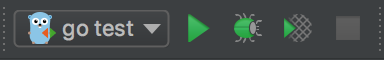

Jetbrains GoLand 的使用

## 环境准备
1. 下载 Gogland，安装 Go 环境
安装方法多样，首先可参考官网安装指南，但如果你有 Go 多版本的需求（比如新老版本共存），想简化 Go 配置过程（省去GOPATH、GOROOT等的配置），还希望它支持跨平台（支持Mac和Linux），那么特别推荐这款 Go 环境安装工具：GVM —— 详情可参考这篇文章[《Go 语言多版本安装及管理利器 - GVM》](https://bingohuang.com/go-gvm/)。

2. 设置工作空间

```
- workspace
    - bin
    - pkg
    - src
        - github.com
            - user_name
                - project1
                - project2
```
然后将该工作空间（workspace 所在目录）设置到 GOPATH 当中。GOPATH 可用于 Go 导入、安装、构建和更新，还会被 Goland 自动识别。
[tips:]如果采用上述说的 GVM 的安装方式，将自动创建一个 Workspace，并配置好 GOPATH 等相关环境变量，这也是 GVM 方便的地方。

## 一般使用


### 设置 Gogland 的 GOROOT
在 Gogland 中，需要配置当前项目的 GOROOT，用来编译运行 Go 代码。配置起来也非常方便，打开 Settings → Go → GOROOT 设置即可：
如果你本地安装了多个版本的 Go，也可以在右侧下拉选择相应的版本，这依赖于你本地有多个版本的 Go 环境了。

### 设置 Gogland 的 GOPATH
Gogland 中的 GOPATH 设置功能非常实用和强大，你既可以配置多个全局的 GOPATH （IDE 会自动识别环境变量中的 GOPATH，可不勾选），也可以配置多个项目级别的 GOPATH，甚至还可以配置多个模块级别的 GOPATH。打开 Settings → Go → GOPATH 设置如下： 

### 建立新的 Go 项目
在主菜单选择 File → New → Project， 继而弹出 New Project 设置向导：

此处就需要选择你在上面配置好的 GOROOT，新建的项目会自动关联全局 GOPATH，你还可以参照第四节说是设置你项目的 GOPATH。

### 导入已有 Go 项目
如果本地已有 Go 项目代码，只需在主菜单选择 File → Open，打开你的项目目录即可。

最新版的 Gogland有一个非常体贴的小功能，会自动匹配你当前设置好的全局 GOROOT。当然，你也可以在设置中更换。

接下来会开始建立索引（index），第一次建立的时候可能会比较慢，CPU消耗比较大，耗时长短依赖于你工作空间的代码量，但后续用起来就非常快捷了，索引的建立也是增量的。


### 运行/调试/测试程序
当有了一个 Go 项目工程，二话不说，先跑跑看（前提是你要有一个可执行入口，在 main package 下的 main 函数）。

为了在 Gogland 运行一个 Go 程序，你需要用到 Run Configuration。使用方法如下：

* 在主菜单栏或工具栏打开：Run → Edit Configurations
* 点击 Edit Configurations，打开 Run/Debug Configuration 对话框
* 点击 + 号按钮，选择你需要的运行配置，Go 用到的配置类型如下（按使用频率解释）：

Go Application：相当于执行 go build 和运行可执行文件命令，该配置会生成可执行文件，也可执行debug
Go Single File：相当于 go run 命令，该配置不会生成可执行文件，不能执行 debug
Go Test：用于运行测试代码，相当于 go test，有三种测试框架可供选择：gotest，gocheck 和 gobench
Go Remote：提供了 Go 的远程调试支持，你只需要设置要远程连接的 Host 和 Port，并且保证你要调试的程序是通过 Delve 启动的
Go App Engine：允许你将程序部署到 Google AppEngine，前提是你有使用 Google 云，并且你的程序模块加载了 Go AppEngine SDK
以上就是 Go 工程在运行/调试/测试过程中会用到的配置类型，特别是前三项，最为常用。


如果你要运行程序，推荐使用1和2。而 Gogland 智能的地方在于，你可以通过鼠标右击这样快捷的方式来运行和配置，如下，在有 main 函数的地方右击即可： gogland-run.png

如果你要调试程序，本地调试可用1，远程调试请使用4。

如果你要测试程序，请使用第3种方式。

同时，在测试程序的基础上，你还可以执行调试和代码覆盖率统计，功能十分强大！  


总的来说，Gogland 继承了 Jetbrains 家族的基因，完全可以作为 Go 语言编程的神兵利器。

# 快捷键


# 参考
1. Jetbrains 家族利器之 Gogland 简明教程 . https://gocn.vip/article/445