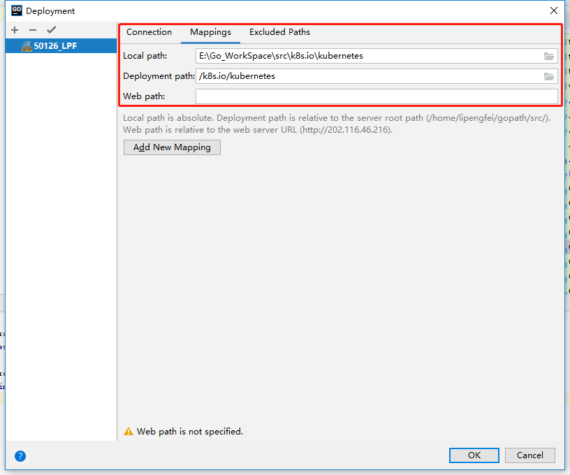

# 搭建Kubernetes开发环境
>在Windows上使用GoLand IDE查看Kubernetes项目源码，在Linux上编译项目。在Linux上安装FTP服务来同步Windows和Linux之间的代码。

## 在Linux上搭建FTP服务器并尝试编译K8S
创建一个如下的目录结构
```
- gopath
  - bin
  - pkg
  - src
    - k8s.io
```
设置 ~/gopath 为GOPATH，在 ~/.bashrc 中添加一行
```
export GOPATH="~/gopath"
```
然后
```
go get -d k8s.io/kubernetes
cd $GOPATH/src/k8s.io/kubernetes
make
```
如果make未出现错误则表示成功。make需要安装gcc编译器。

## 在Windows上安装IDE以及代码
GoLand下载地址：https://www.jetbrains.com/go/download/

License server地址：http://idea.youbbs.org（2018.1.15更新GoLand可用）

创建一个如下的目录结构
```
- gopath
  - bin
  - pkg
  - src
    - k8s.io
```
然后
```
cd $HOME/gopath/src/k8s.io
git clone https://github.com/kubernetes/kubernetes.git
```
在项目目录下使用 go get 命令，会从互联网上解析下载项目依赖的包。使你看代码的时候不会出现标识符找不到变成红色的情况，更加方便你看代码。 Go 1.5之后使用了vendor这种包管理机制，无须使用go get。

用GoLand打开 `$HOME/gopath/src/k8s.io/kubernetes` 这个项目。使用JetBrains IDE的好处有很多，比如可视化地查看代码结构，全文检索代码、各种工具的GUI化、集成化等。但是IDE是安装在Windows上的，但是Kubernetes的代码只能在Linux上编译。

## 在GoLand上使用插件访问FTP服务实现文件同步
需要在 Setting=>Plugins 中安装 Remote Hosts Access 这个插件。重启IDE之后，在 Setting 中搜索 Deployment，新增一项，主要需要配置两个tab。下面图一中有一种错误：Root path的路径必须和Windows上项目的根路径保持一致，下图中的Root path应该改为：`/home/lipengfei/gopath/src/`, Mapping 改为 `/k8s.io/kubernetes` 。

Connection   


Mappings  


这里要注意如果用的是匿名用户，默认是没有所有目录访问权限的。这里使用的 lipengfei 用户，具有所有目录文件的访问权限。

配置好之后，可以在菜单栏=>Tools=>Deployment=>Browse Remote Host查看刚刚添加的远程主机中的目录（能看到的范围根据你设置的根目录而定）。

因为Kubernetes项目非常大，不建议使用全量的upload功能，这样会扫描全部文件并且传输全部内容。我们可以在Windows上修改了一个文件之后，在Project视图中点击Upload to dev然后就可以同步到远程主机。然后可以在远程Linux主机中使用make编译Kubernetes项目。


# 参考
1. 一种Kubernetes开发环境搭建的思路 . http://lioncruise.github.io/2018/01/15/develop-k8s-guide/
2. Jetbrains 家族利器之 Gogland 简明教程 . https://gocn.vip/article/445
