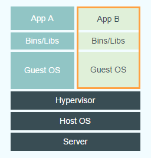
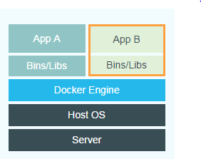

# Kubernetes学习之路

Kubernetes(国人简称 k8s)是Google开源的容器集群管理系统。在Docker基础上，为容器化的应用提供部署运行、资源调度、服务发现和动态伸缩等一系列完整功能。

Kubernetes 是一个完备的分布式系统支撑平台，具备的能力:

* 多层次的安全防护和准入机制
* 多租户应用支撑能力
* 透明的服务注册和服务发现机制
* 内建的智能负载均衡器
* 强大的故障发现和自我修复能力
* 服务滚动升级和在线扩容能力
* 可扩展的资源自动调度机制
* 多粒度的资源配额管理能力

## Dokcer基础

## Kubernetes基础

1. [Kubernetes命令](basic/kube_cli.md)

## Kubernetes源码解读

1. [k8s调度详解](./arch/scheduler/k8s调度器详解.md)

## 推荐资源

### 在线博客

1. [kubernetes官方手册](https://kubernetes.io/zh/)
2. [从Docker到Kubernetes进阶](https://www.qikqiak.com/k8s-book/)
3. [CKA考试讲解，3天速成K8S](https://bbs.huaweicloud.com/videos/102361)
4. [和我一步步部署 kubernetes 集群](https://github.com/opsnull/follow-me-install-kubernetes-cluster) 

### 书籍
1. [书单推荐](booklist.md)

## 更多参考

1. [Python微服务应用](https://www.qikqiak.com/tdd-book/)

----------------------------------------

**项目规范**

本文使用 [`Markdown`](https://www.markdownguide.org/basic-syntax) 编写, 排版符合[`中文技术文档写作规范`](https://github.com/hbulpf/document-style-guide)。Find Me On [**Github**](https://github.com/hbulpf/k8spath) , [**Gitee**](https://gitee.com/sifangcloud/k8spath)

**友情贡献**

@[**RunAtWorld**](http://www.github.com/RunAtWorld)  &nbsp; 

#### 关注公众号 『四方云和』 获取更多优质文章 ~

