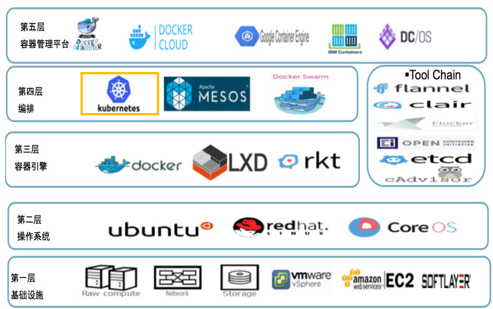
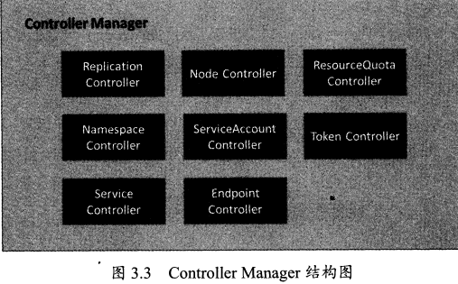
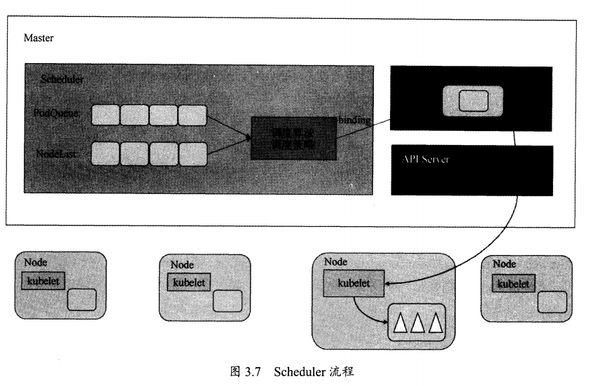

# Kubernetes 架构

> Kubernetes API Server , Controller Manager , Scheduler , kubelet , kube-proxy




## Kubernetes API Server

Kubernetes API Server 的核心功能提供了 Kubernetes 各类资源对象(Pod、RC、Service)的增删查改及Watch等 HTTP Rest 接口，成为集群内各个功能模块之间数据交互和通信的中心枢纽，是整个系统的数据总线和数据中心，是集群管理的API入口，资源配额控制的入口，提供完备的集群安全机制。

## Controller Manager 

Controller Manager 是集群内部的管理控制中心，负责集群中的Node、Pod副本、服务端点(Endpoint)、命名空间(Namespace)、服务账号(Service Account)、资源配额(ResourceQuota)等的管理，当某个Node意外宕机时，Controller Manager会及时发现此故障并执行自动化修复流程，确保集群始终处于预期的工作状态。


## Scheduler

Kubernetes Scheduler 是负责Pod调度的重要功能模块再整个系统中有“承上启下”的作用。它负责接收 Controller Manager 创建新Pod的请求，为新Pod找到一个目标Node,新Pod创建后，目标Node上的kubelet服务进程负责Pod的剩余生命周期。

具体来说，Kubernetes Scheduler 的作用是将待调度的Pod(包括Kubernetes API 新创建的Pod、Controller Manager为补足副本而创建的Pod)按照特定的调度算法和调度策略绑定到集群中某个合适的Node上，并将绑定信息写入etcd。整个调度过程涉及到三个对象：待调度Pod列表、可用Node列表以及调度算法和策略。

简单来讲，Kubernetes Scheduler 的核心工作就是通过调度算法为待调度Pod列表的每个 Pod 从 Node 列表中选择一个最适合的Node。随后，目标节点上的 kubelet 通过 API Server 监听到 Kubernetes Scheduler 产生的 Pod 绑定事件，然后获取对应的Pod清单，下载Image镜像，并启动容器。



在 kube-scheduler 的启动参数中 ，`--algorithm-provider="DefaultProvider"` 用于设置调度算法，默认为 DefaultProvider 。默认调度过程如下[[1]]():
1. 预选调度过程，即遍历所有目标 Node ，选出符合要求的候选节点。为此，Kubernetes内置了多种预选策略(xxx Predicates) 供用户选择
2. 确定最优节点。在第1步的基础上，采取优选策略(xxx Prioritt)计算出每个候选节点的积分，积分高者胜出。

Kubernetes Scheduler的调度流程是通过插件方式加载的“调度算法提供者”(AlgorithmProvider)具体实现的。一个AlgorithmProvider就是包括了一组预选调度策略与一组优先选择策略的结构体，注册 RegisterAlgorithmProvider 的函数在包 `\kubernetes\cmd\kube-scheduler\app\server.go`,如下：
```
func RegisterAlgorithmProvider(name string, predicateKeys, priorityKeys sets.String) string {
    schedulerFactoryMutex.Lock()
    defer schedulerFactoryMutex.Unlock()
    validateAlgorithmNameOrDie(name)
    algorithmProviderMap[name] = AlgorithmProviderConfig{
        FitPredicateKeys:     predicateKeys,
        PriorityFunctionKeys: priorityKeys,
    }
    return name
}
```
这3个参数: "name string" 为算法名，"predicateKeys" 为算法用到的预选策略集合， 
"priorityKeys sets.String" 为算法用到的优选策略集合。

其中 Scheduler 可用的预选策略有:
```
CheckNodeCondition：#检查节点是否正常（如ip，磁盘等）
GeneralPredicates
    HostName：#检查Pod对象是否定义了pod.spec.hostname
    PodFitsHostPorts：#pod要能适配node的端口 pods.spec.containers.ports.hostPort（指定绑定在节点的端口上）
    MatchNodeSelector：#检查节点的NodeSelector的标签  pods.spec.nodeSelector
    PodFitsResources：#检查Pod的资源需求是否能被节点所满足
NoDiskConflict: #检查Pod依赖的存储卷是否能满足需求（默认未使用）
PodToleratesNodeTaints：#检查Pod上的spec.tolerations可容忍的污点是否完全包含节点上的污点；
PodToleratesNodeNoExecuteTaints：#不能执行（NoExecute）的污点（默认未使用）
CheckNodeLabelPresence：#检查指定的标签再上节点是否存在
CheckServiceAffinity：#将相同services相同的pod尽量放在一起（默认未使用）
MaxEBSVolumeCount： #检查EBS（AWS存储）存储卷的最大数量
MaxGCEPDVolumeCount #GCE存储最大数
MaxAzureDiskVolumeCount: #AzureDisk 存储最大数
CheckVolumeBinding： #检查节点上已绑定或未绑定的pvc
NoVolumeZoneConflict： #检查存储卷对象与pod是否存在冲突
CheckNodeMemoryPressure：#检查节点内存是否存在压力过大
CheckNodePIDPressure：  #检查节点上的PID数量是否过大
CheckNodeDiskPressure： #检查内存、磁盘IO是否过大
MatchInterPodAffinity:  #检查节点是否能满足pod的亲和性或反亲和性
```

其中默认的预选策略为:
>

Scheduler 可用的优选策略有:
```
LeastRequested：#空闲量越高得分越高
（cpu((capacity-sum(requested))*10/capacity)+memory((capacity-sum(requested))*10/capacity))/2
BalancedResourceAllocation：#CPU和内存资源被占用率相近的胜出；
NodePreferAvoidPods:  #节点注解信息“scheduler.alpha.kubernetes.io/preferAvoidPods”
TaintToleration：#将Pod对象的spec.tolerations列表项与节点的taints列表项进行匹配度检查，匹配条目越，得分越低；
SeletorSpreading：#标签选择器分散度，（与当前pod对象通选的标签，所选其它pod越多的得分越低）
InterPodAffinity：#遍历pod对象的亲和性匹配项目，项目越多得分越高
NodeAffinity： #节点亲和性
MostRequested： #空闲量越小得分越高，和LeastRequested相反 （默认未启用）
NodeLabel：    #节点是否存在对应的标签 （默认未启用）
ImageLocality：#根据满足当前Pod对象需求的已有镜像的体积大小之和（默认未启用）
```

## kubelet 

## kube-proxy涉及

# 参考
1. 龚正,吴治辉等 . Kubernetes权威指南:从Docker到Kubernetes全接触[M] . 北京：电子工业出版社,2016:177-194
2. k8s调度器、预选策略及调度方式 . https://www.cnblogs.com/zhangb8042/p/10203266.html
3. k8s scheduler pod调度分析 . https://blog.csdn.net/weixin_39961559/article/details/81704461
4. Pod Priority and Preemption . https://kubernetes.io/docs/concepts/configuration/pod-priority-preemption/
