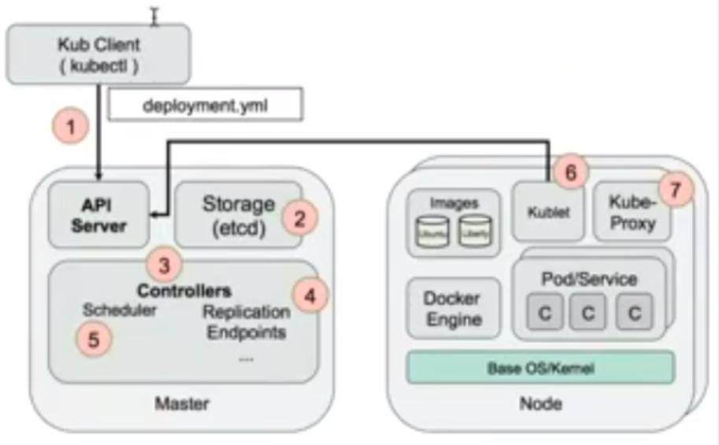
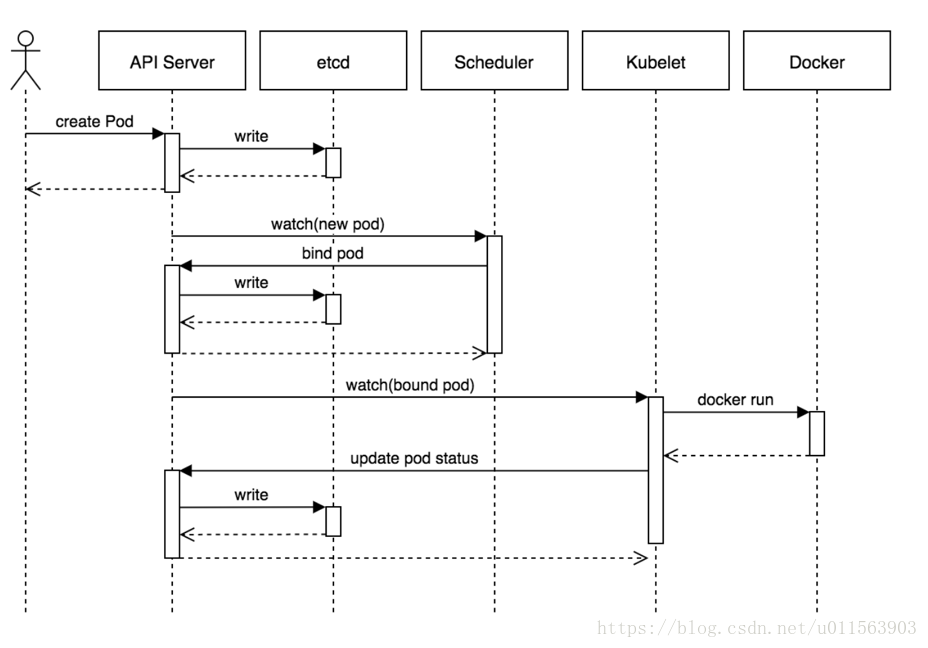

# Kubernetes 架构

> Kubernetes API Server , Controller Manager , Scheduler , kubelet , kube-proxy

Kubernetes是一个轻便的和可扩展的开源平台，用于管理容器化应用和服务。通过Kubernetes能够进行应用的自动化部署和扩缩容。在Kubernetes中，会将组成应用的容器组合成一个逻辑单元以更易管理和发现。Kubernetes积累了作为Google生产环境运行工作负载15年的经验，并吸收了来自于社区的最佳想法和实践。Kubernetes经过这几年的快速发展，形成了一个大的生态环境，Google在2014年将Kubernetes作为开源项目。Kubernetes的关键特性包括：

* 自动化装箱：在不牺牲可用性的条件下，基于容器对资源的要求和约束自动部署容器。同时，为了提高利用率和节省更多资源，将关键和最佳工作量结合在一起。
* 自愈能力：当容器失败时，会对容器进行重启；当所部署的Node节点有问题时，会对容器进行重新部署和重新调度；当容器未通过监控检查时，会关闭此容器；直到容器正常运行时，才会对外提供服务。
* 水平扩容：通过简单的命令、用户界面或基于CPU的使用情况，能够对应用进行扩容和缩容。
* 服务发现和负载均衡：开发者不需要使用额外的服务发现机制，就能够基于Kubernetes进行服务发现和负载均衡。
* 自动发布和回滚：Kubernetes能够程序化的发布应用和相关的配置。如果发布有问题，Kubernetes将能够回归发生的变更。
* 保密和配置管理：在不需要重新构建镜像的情况下，可以部署和更新保密和应用配置。
* 存储编排：自动挂接存储系统，这些存储系统可以来自于本地、公共云提供商（例如：GCP和AWS）、网络存储(例如：NFS、iSCSI、Gluster、Ceph、Cinder和Floker等)。

## 整体架构


Kubernetes属于主从分布式架构，主要由Master Node和Worker Node组成，以及包括客户端命令行工具kubectl和其它附加项。

* Master Node：作为控制节点，对集群进行调度管理；Master Node由API Server、Scheduler、Cluster State Store和Controller-Manger Server所组成；
* Worker Node：作为真正的工作节点，运行业务应用的容器；Worker Node包含kubelet、kube proxy和Container Runtime；
* kubectl：用于通过命令行与API Server进行交互，而对Kubernetes进行操作，实现在集群中进行各种资源的增删改查等操作；
* Add-on：是对Kubernetes核心功能的扩展，例如增加网络和网络策略等能力。
* repliceation 用于伸缩副本数量
* endpoint 用于管理网络请求
* scheduler 调度器

### 用户通过一个Yaml控制k8s产生相应Pod的过程




1. 准备好一个包含应用程序的Deployment的yml文件，然后通过kubectl客户端工具发送给ApiServer。
2. ApiServer接收到客户端的请求并将资源内容存储到数据库(etcd)中。
3. Controller组件(包括scheduler、replication、endpoint)监控资源变化并作出反应。
4. ReplicaSet检查数据库变化，创建期望数量的pod实例。
5. Scheduler再次检查数据库变化，发现尚未被分配到具体执行节点(node)的Pod，然后根据一组相关规则将pod分配到可以运行它们的节点上，并更新数据库，记录pod分配情况。
6. Kubelet监控数据库变化，管理后续pod的生命周期，发现被分配到它所在的节点上运行的那些pod。如果找到新pod，则会在该节点上运行这个新pod。
7. kuberproxy运行在集群各个主机上，管理网络通信，如服务发现、负载均衡。例如当有数据发送到主机时，将其路由到正确的pod或容器。对于从主机上发出的数据，它可以基于请求地址发现远程服务器，并将数据正确路由，在某些情况下会使用轮训调度算法(Round-robin)将请求发送到集群中的多个实例。


### k8s生态


### 创建一个Pod的过程

创建Pod的过程，时序图如下：



1. 用户提交创建Pod的请求，可以通过API Server的REST API ，也可用Kubectl命令行工具，支持Json和Yaml两种格式；
2. API Server 处理用户请求，存储Pod数据到Etcd；
3. Schedule通过和 API Server的watch机制，查看到新的pod，尝试为Pod绑定Node；
4. 过滤主机：调度器用一组规则过滤掉不符合要求的主机，比如Pod指定了所需要的资源，那么就要过滤掉资源不够的主机；
5. 主机打分：对第一步筛选出的符合要求的主机进行打分，在主机打分阶段，调度器会考虑一些整体优化策略，比如把一个Replication Controller的副本分布到不同的主机上，使用最低负载的主机等；
6. 选择主机：选择打分最高的主机，进行binding操作，结果存储到Etcd中；
7. kubelet根据调度结果执行Pod创建操作：绑定成功后，会启动container, docker run, scheduler会调用API Server的API在etcd中创建一个bound pod对象，描述在一个工作节点上绑定运行的所有pod信息。运行在每个工作节点上的kubelet也会定期与etcd同步bound pod信息，一旦发现应该在该工作节点上运行的bound pod对象没有更新，则调用Docker API创建并启动pod内的容器。

## Kubernetes API Server

Kubernetes API Server 的核心功能提供了 Kubernetes 各类资源对象(Pod、RC、Service)的增删查改及Watch等 HTTP Rest 接口，成为集群内各个功能模块之间数据交互和通信的中心枢纽，是整个系统的数据总线和数据中心，是集群管理的API入口，资源配额控制的入口，提供完备的集群安全机制。

API Server是所有REST命令的入口，它的相关结果状态将被保存在etcd（或其他存储）中。API Server的基本功能包括：

* REST语义，监控，持久化和一致性保证，API 版本控制，放弃和生效
* 内置准入控制语义，同步准入控制钩子，以及异步资源初始化
* API注册和发现
  
另外，API Server也作为集群的网关。默认情况，客户端通过API Server对集群进行访问，客户端需要通过认证，并使用API Server作为访问Node和Pod（以及service）的堡垒和代理/通道。

## etcd

Kubernetes默认使用etcd作为集群整体存储，当然也可以使用其它的技术。etcd是一个简单的、分布式的、一致的key-value存储，主要被用来共享配置和服务发现。etcd提供了一个CRUD操作的REST API，以及提供了作为注册的接口，以监控指定的Node。集群的所有状态都存储在etcd实例中，并具有监控的能力，因此当etcd中的信息发生变化时，就能够快速的通知集群中相关的组件。

## Controller Manager 

Controller Manager 是集群内部的管理控制中心，负责集群中的Node、Pod副本、服务端点(Endpoint)、命名空间(Namespace)、服务账号(Service Account)、资源配额(ResourceQuota)等的管理，当某个Node意外宕机时，Controller Manager会及时发现此故障并执行自动化修复流程，确保集群始终处于预期的工作状态。

Controller-Manager Serve用于执行大部分的集群层次的功能，它既执行生命周期功能(例如：命名空间创建和生命周期、事件垃圾收集、已终止垃圾收集、级联删除垃圾收集、node垃圾收集)，也执行API业务逻辑（例如：pod的弹性扩容）。控制管理提供自愈能力、扩容、应用生命周期管理、服务发现、路由、服务绑定和提供。

Kubernetes默认提供Replication Controller、Node Controller、Namespace Controller、Service Controller、Endpoints Controller、Persistent Controller、DaemonSet Controller等控制器。

## Scheduler

scheduler组件为容器自动选择运行的主机。依据请求资源的可用性，服务请求的质量等约束条件，scheduler监控未绑定的pod，并将其绑定至特定的node节点。Kubernetes也支持用户自己提供的调度器，Scheduler负责根据调度策略自动将Pod部署到合适Node中，调度策略分为预选策略和优选策略，Pod的整个调度过程分为两步：

1. 预选Node：遍历集群中所有的Node，按照具体的预选策略筛选出符合要求的Node列表。如没有Node符合预选策略规则，该Pod就会被挂起，直到集群中出现符合要求的Node。
2. 优选Node：预选Node列表的基础上，按照优选策略为待选的Node进行打分和排序，从中获取最优Node。

## kubelet 

Kubelet是Kubernetes中最主要的控制器，它是Pod和Node API的主要实现者，Kubelet负责驱动容器执行层。在Kubernetes中，应用容器彼此是隔离的，并且与运行其的主机也是隔离的，这是对应用进行独立解耦管理的关键点。

在Kubernets中，Pod作为基本的执行单元，它可以拥有多个容器和存储数据卷，能够方便在每个容器中打包一个单一的应用，从而解耦了应用构建时和部署时的所关心的事项，已经能够方便在物理机/虚拟机之间进行迁移。API准入控制可以拒绝或者Pod，或者为Pod添加额外的调度约束，但是Kubelet才是Pod是否能够运行在特定Node上的最终裁决者，而不是scheduler或者DaemonSet。kubelet默认情况使用cAdvisor进行资源监控。负责管理Pod、容器、镜像、数据卷等，实现集群对节点的管理，并将容器的运行状态汇报给Kubernetes API Server。

### Container Runtime

每一个Node都会运行一个Container Runtime，其负责下载镜像和运行容器。Kubernetes本身并不停容器运行时环境，但提供了接口，可以插入所选择的容器运行时环境。kubelet使用Unix socket之上的gRPC框架与容器运行时进行通信，kubelet作为客户端，而CRI shim作为服务器。


protocol buffers API提供两个gRPC服务，ImageService和RuntimeService。ImageService提供拉取、查看、和移除镜像的RPC。RuntimeSerivce则提供管理Pods和容器生命周期管理的RPC，以及与容器进行交互(exec/attach/port-forward)。容器运行时能够同时管理镜像和容器（例如：Docker和Rkt），并且可以通过同一个套接字提供这两种服务。在Kubelet中，这个套接字通过–container-runtime-endpoint和–image-service-endpoint字段进行设置。

Kubernetes CRI支持的容器运行时包括docker、rkt、cri-o、frankti、kata-containers和clear-containers等。

## kube-proxy

基于一种公共访问策略（例如：负载均衡），服务提供了一种访问一群pod的途径。此方式通过创建一个虚拟的IP来实现，客户端能够访问此IP，并能够将服务透明的代理至Pod。每一个Node都会运行一个kube-proxy，kube proxy通过iptables规则引导访问至服务IP，并将重定向至正确的后端应用，通过这种方式kube-proxy提供了一个高可用的负载均衡解决方案。服务发现主要通过DNS实现。

在Kubernetes中，kube proxy负责为Pod创建代理服务；引到访问至服务；并实现服务到Pod的路由和转发，以及通过应用的负载均衡。

## kubectl

kubectl是Kubernetes集群的命令行接口。运行kubectl命令的语法如下所示：
```
$ kubectl [command] [TYPE] [NAME] [flags]
```
这里的command，TYPE、NAME和flags为：

- comand：指定要对资源执行的操作，例如create、get、describe和delete
- TYPE：指定资源类型，资源类型是大小学敏感的，开发者能够以单数、复数和缩略的形式。例如：

```
$ kubectl get pod pod1 
$ kubectl get pods pod1 
$ kubectl get po pod1
```

NAME：指定资源的名称，名称也大小写敏感的。如果省略名称，则会显示所有的资源，例如:
```
$kubectl get pods
```

- flags：指定可选的参数。例如，可以使用-s或者–server参数指定Kubernetes API server的地址和端口。

另外，可以通过运行kubectl help命令获取更多的信息。

## 附加项和其他依赖
在Kunbernetes中可以以附加项的方式扩展Kubernetes的功能，目前主要有网络、服务发现和可视化这三大类的附加项，下面是可用的一些附加项：

### 网络和网络策略

* ACI 通过与Cisco ACI集成的容器网络和网络安全。
* Calico 是一个安全的3层网络和网络策略提供者。
* Canal 联合Fannel和Calico。
* Cilium 是一个3层网络和网络侧插件，它能够透明的加强HTTP/API/L7 策略。其即支持路由，也支持overlay/encapsultion模式。
* Flannel 是一个overlay的网络提供者。
* istio 是 通过Pod代理的方式，实现k8s平台的 连接、安全加固、控制和观察服务。

### 服务发现

* CoreDNS 是一个灵活的，可扩展的DNS服务器，它能够作为Pod集群内的DNS进行安装。
* Ingress 提供基于Http协议的路由转发机制。

### 可视化&控制

* Dashboard 是Kubernetes的web用户界面。


# 参考

1. 龚正,吴治辉等 . Kubernetes权威指南:从Docker到Kubernetes全接触[M] . 北京：电子工业出版社,2016:177-194
2. [k8s-整体概述和架构](https://www.cnblogs.com/wwchihiro/p/9261607.html)
