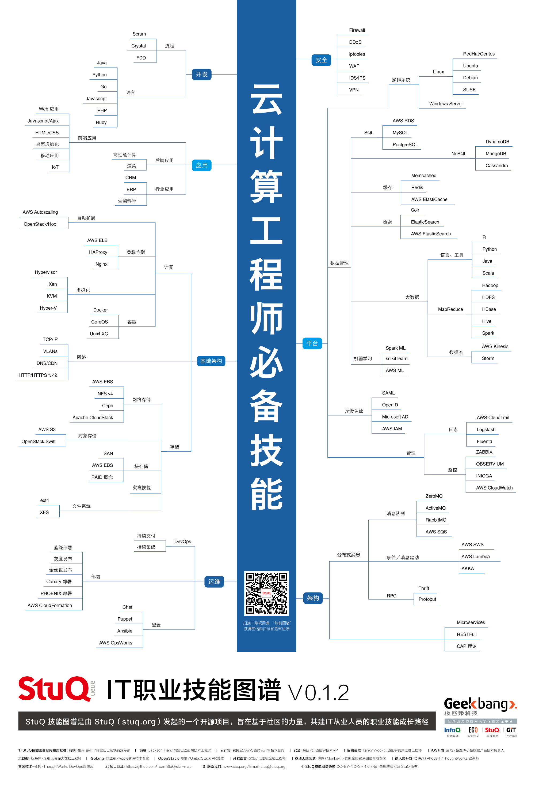

# 书单

+ **Docker 相关**
    1. [Docker 从入门到实践](https://github.com/yeasy/docker_practice) : [下载PDF](https://github.com/hbulpf/MLBooks/blob/master/6_%E4%BA%91%E8%AE%A1%E7%AE%97/docker_practice.pdf)
    
+ **Kubernetes 相关**
    1. 入门推荐: [kubernetes-handbook](https://jimmysong.io/kubernetes-handbook)
    2. 入门推荐: Kubernetes权威指南第2版: [下载PDF](https://github.com/hbulpf/MLBooks/blob/master/6_%E4%BA%91%E8%AE%A1%E7%AE%97/Kubernetes%E6%9D%83%E5%A8%81%E6%8C%87%E5%8D%97%E7%AC%AC2%E7%89%88.pdf)
    3. 中级推荐: [深入剖析Kubernetes](https://item.jd.com/13184526.html)

+ 云计算工程师技能
	